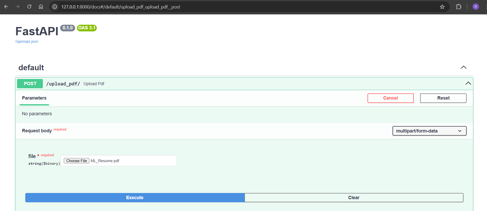
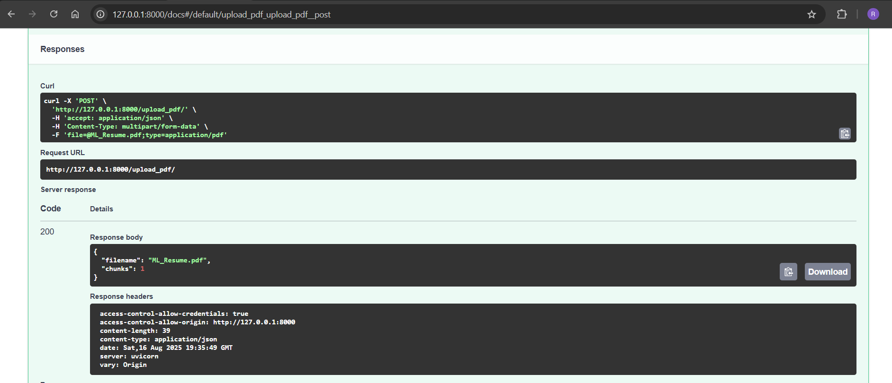
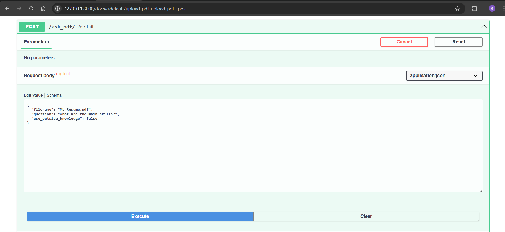
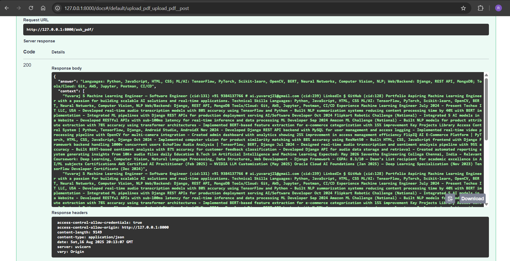

# AI-Powered PDF Context Retrieval Chatbot (RAG)

This repository contains a backend system that ingests PDFs, indexes their content for semantic search using FAISS, and answers user queries via a Retrieval-Augmented Generation (RAG) pipeline powered by Google Gemini LLM. The system exposes REST API endpoints through FastAPI for uploading PDFs and querying context-aware answers.

---

## 🚀 Project Overview

**Objective:**  
Build a backend that accepts any PDF document, processes it into searchable chunks with embeddings stored in a vector database, and uses a large language model (LLM) for contextually accurate question answering.

---

## 📦 Features

- **PDF Processing & Retrieval:**  
  - Upload PDF files via REST API.  
  - Extract text from PDFs, including OCR fallback for scanned documents.  
  - Split text into manageable chunks with overlap.  
  - Generate semantic embeddings per chunk using a Sentence Transformer.  
  - Store embeddings in a FAISS vector database with persistent save/load.

- **Retrieval-Augmented Generation (RAG):**  
  - Retrieve most relevant chunks from PDFs using cosine similarity search in FAISS.  
  - Pass retrieved chunks alongside user questions to Google Gemini LLM.  
  - Generate precise answers referencing PDF context.  
  - Return both LLM answer and source context chunks in responses.

- **FastAPI Backend:**  
  - REST API endpoints to upload PDFs and query uploaded documents.  
  - Input validation and error handling using Pydantic models.  
  - CORS enabled for cross-origin requests.  
  - Modular, clean, production-ready codebase.

---

## 🛠 Technology Stack

| Component               | Technology/Library                   |
|------------------------|------------------------------------|
| API Framework           | FastAPI                            |
| PDF Text Extraction     | pdfplumber, pytesseract, pdf2image |
| Text Embeddings         | Sentence Transformers (`all-MiniLM-L6-v2`) |
| Vector Store            | FAISS                             |
| Large Language Model    | Google Gemini via `google-genai` SDK |
| Environment Management  | python-dotenv                     |

---

## 🔧 Setup Instructions

### 1. Clone the repository
```
git clone https://github.com/Yuvaraj878/6sconsulting-loan-risk-and-rag.git
```


### 2. Install dependencies
```
fastapi
uvicorn
python-multipart
pdfplumber
pytesseract
pdf2image
Pillow
sentence-transformers
scikit-learn
faiss-cpu
python-dotenv
google-genai

```


### 3. Configure environment variables

Create a `.env` file in the project root with your Google API key: 
```
GOOGLE_API_KEY=your_google_genai_api_key_here
```


### 4. Run the FastAPI server

```
uvicorn app.main:app --reload
```


Server will start on [http://127.0.0.1:8000](http://127.0.0.1:8000).

---

## 🎯 API Endpoints

### Upload PDF and Index Content

- **URL:** `/upload_pdf/`  
- **Method:** POST  
- **Content-Type:** `multipart/form-data`  
- **Form Data:**  
  - `file`: PDF file to upload  
- **Response Example:**  
```
{
"filename": "ML_Resume.pdf",
"chunks": 25
}
```


### Ask a Question About a PDF

- **URL:** `/ask_pdf/`  
- **Method:** POST  
- **Content-Type:** `application/json`  
- **Body Schema:**  
```
{
"filename": "ML_Resume.pdf",
"question": "What are the candidate's skills?",
"use_outside_knowledge": false
}
```
- **Response Example:**  
```
{
"answer": "The candidate has experience in machine learning, data analysis, and Python programming.",
"context": [
"Context chunk 1 text ...",
"Context chunk 2 text ...",
"Context chunk 3 text ..."
]
}
```


### Healthcheck

- **URL:** `/`  
- **Method:** GET  
- **Response:**  
```
{"message": "Gemini PDF RAG FastAPI is running"}
```
## Output
- **Post-Upload-pdf:** 





- **Post-ask-pdf** 





---

## 📂 Project Structure

```
├── app/
│ ├── main.py # FastAPI app entry and routes
│ ├── rag.py # PDF processing, chunking, embedding, retrieval, and LLM integration logic
│ ├── vectordb.py # FAISS vector database wrapper with save/load
│ ├── models.py # Pydantic request and response schemas
│ └── init.py
├── pdfs/ # Uploaded PDF files (created at runtime)
├── indexes/ # Saved FAISS indexes and chunk metadata (created at runtime)
├── .env # Environment variables (API key)
├── requirements.txt # Python dependencies
├── README.md # This file
```


---

## ⚙️ Notes & Recommendations

- The FAISS index and chunk metadata are saved to disk with PDF filename as key. Do not delete `indexes/` to retain indexing between restarts.
- The system currently caches indices in memory during server runtime; for production usage behind multiple instances, consider a centralized vector DB like Pinecone or Chroma.
- “Use outside knowledge” toggles whether Gemini uses only PDF context or external knowledge when generating answers.
- Ensure your Google GenAI API key has proper permissions.

---

## 🤝 Contributing

Contributions, issues, and feature requests are welcome! Please fork the repo and submit pull requests.

---

## 📜 License

This project is licensed under the Apache 2.0 License.

---

## 🙏 Acknowledgements

- Google GenAI & Gemini LLM  
- Sentence Transformers community  
- FastAPI framework  
- FAISS project

---

## 📫 Contact

For questions or support, open an issue or contact [your email/contact].

---

**Enjoy exploring your AI-powered PDF chatbot!**  
Feel free to raise issues or request enhancements.
