# 🏦 Loan Default Risk Scoring API

An AI-powered end-to-end system for predicting borrower loan default risk, featuring robust data science, machine learning, and a fully-documented FastAPI backend.

---

## 🚀 Project Overview

This project delivers a production-ready solution for real-time loan default risk evaluation.  
It includes model training, evaluation, and a RESTful API for score serving—helping lenders and analysts estimate borrower risk efficiently.

---

## 📊 Features

- **Data Science & ML**
  - Data cleaning, preprocessing, and feature engineering
  - RandomForest model (GridSearchCV tuned, SMOTE balanced) for default risk prediction
  - Model evaluation (ROC AUC, confusion matrix, classification report)
  - Feature importance analysis

- **API (FastAPI)**
  - `/predict` • POST • Scores probability of default from borrower features
  - `/model-info` • GET • Returns top features influencing default and model meta-info
  - Input validation (Pydantic), robust error handling

- **Visualization**
  - Distributions for all key numeric features
  - Class imbalance and label balance check
  - Feature correlation heatmap
  - Top feature importances plot
  - Model performance (ROC curve)

---

## 🗂️ Directory Structure
```
loan_default_risk_api/
│
├── app/
│ ├── main.py
│ ├── schemas.py
│ ├── model_utils.py
│ └── artifacts/
│ ├── loan_default_model_rfs.joblib
│ ├── model_feature_order.pkl
│ └── 6S_AI_TASK-Loan_default_Loan_default.xlsx
├── notebooks/ (EDA & model training scripts)
├── requirements.txt
└── README.md

```


---

## 🛠️ Setup & Run

1. **Clone this repo & install dependencies:**
```
fastapi==0.113.0
uvicorn[standard]==0.23.1
pydantic==2.8.0
scikit-learn==1.3.0
pandas==2.0.1
imblearn==0.1.10
matplotlib==3.7.1
seaborn==0.12.2
joblib==1.3.1
openpyxl==3.1.2
```

2. **Start the FastAPI server:**

```
uvicorn app.main:app --reload
```


3. **Access Docs & Test Endpoints:**
- [http://127.0.0.1:8000/docs](http://127.0.0.1:8000/docs) — Interactive Swagger UI

---

## 📥 Example: Predict Endpoint

**POST** `/predict`  
```
{
"Age": 52,
"Income": 45000,
"LoanAmount": 120000,
"CreditScore": 590,
"MonthsEmployed": 20,
"NumCreditLines": 1,
"InterestRate": 13.2,
"LoanTerm": 48,
"DTIRatio": 0.77,
"Education": "High School",
"EmploymentType": "Unemployed",
"MaritalStatus": "Single",
"HasMortgage": "No",
"HasDependents": "No",
"LoanPurpose": "Auto",
"HasCoSigner": "Yes"
}
```

**Response:**

```
{
"risk_score": 0.56,
"predicted_default": true
}
```


---

## 📈 Visualizations (see `notebooks/`)

- **Class Imbalance**  
  
- **Feature Distributions**  
  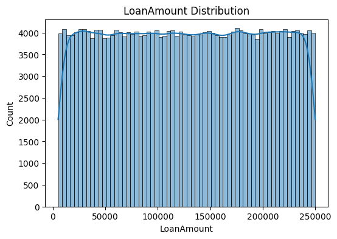
- **Correlation Heatmap**  
  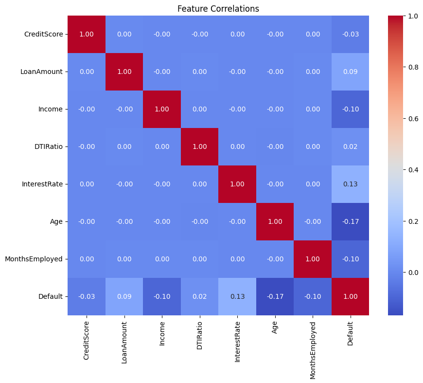
- **Feature Importances**  
  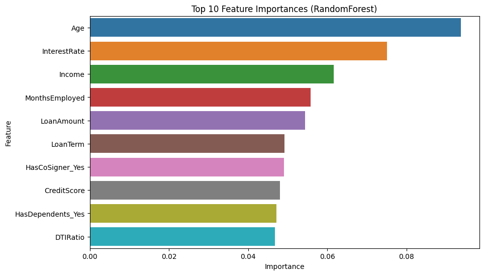
- **ROC Curve**  
  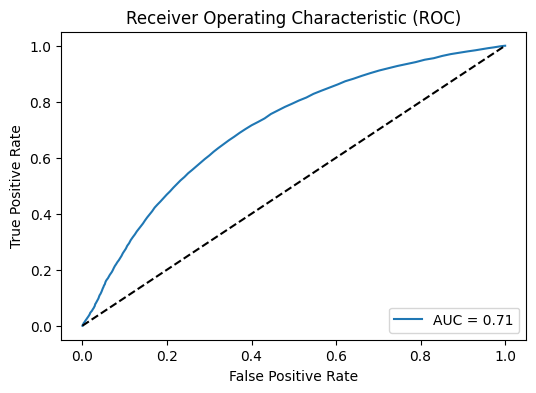

- **Predicted Risk Score Distribution (Test Set)**

  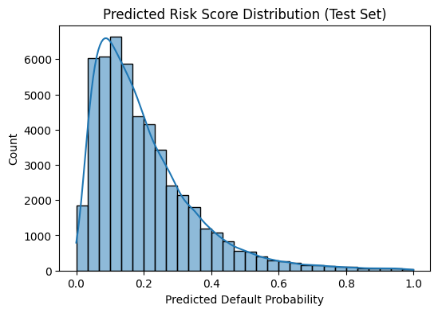

---

## Output 
- **Postman**
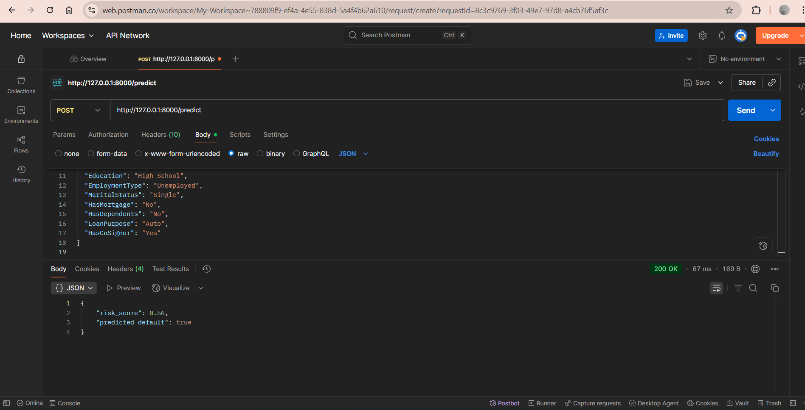

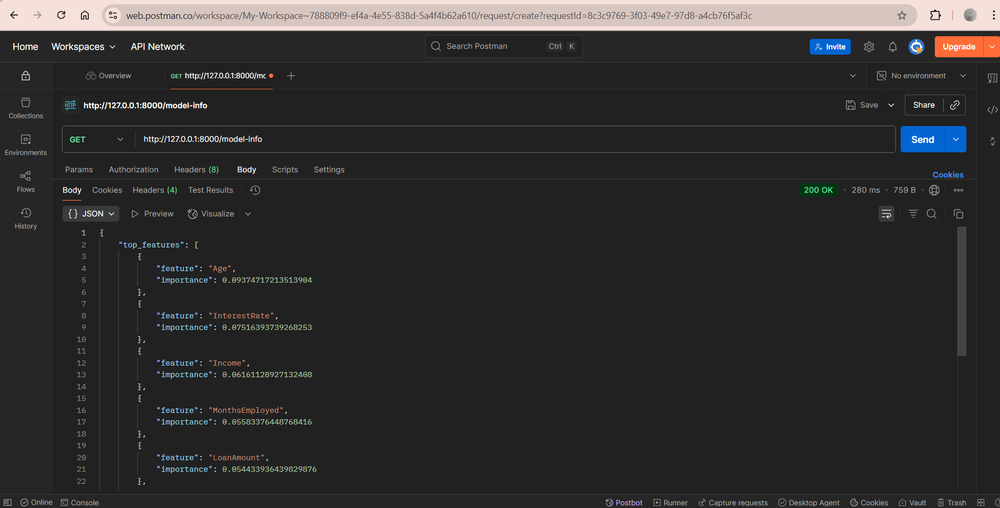

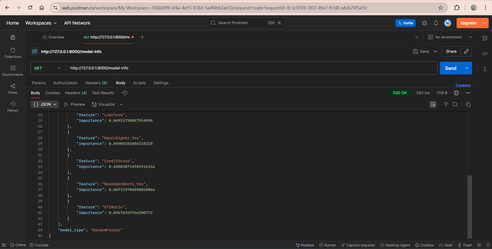

- **Swagger UI**

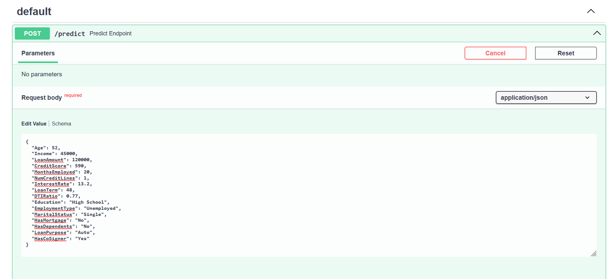

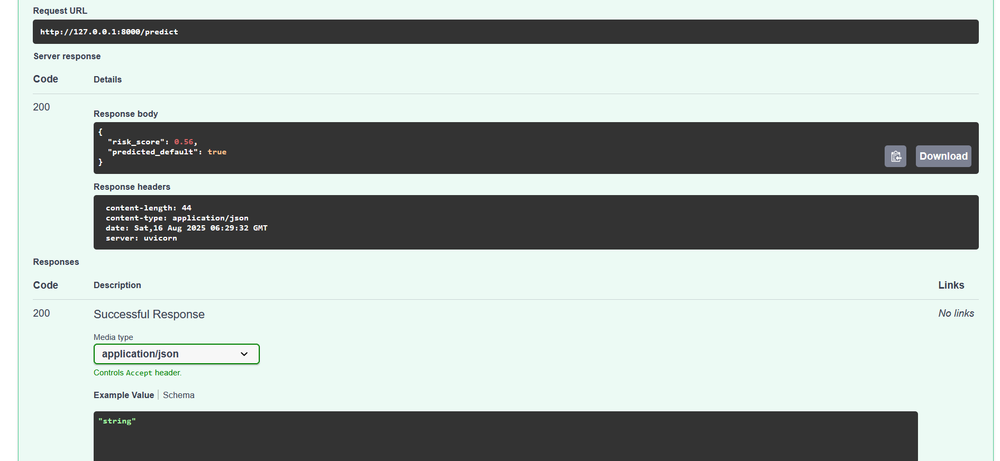

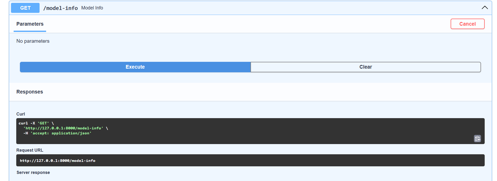

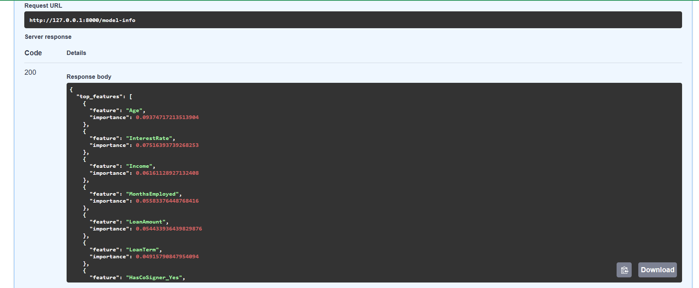


## 📝 Retraining & Updating

- Update artifacts in `app/artifacts/` after retraining (model, feature columns).
- See `notebooks/` for EDA, retraining code, and further model experiments.

---

## 💡 Insights & Impact

- Most predictive features: `LoanAmount`, `CreditScore`, `LoanTerm`, `DTIRatio`, and `EmploymentType`
- Features and risk scoring help lenders make data-driven approvals and set interest rates with confidence.

---

## 🏢 Company  
**6s Consulting — AI Mini-Project Challenge**

---

